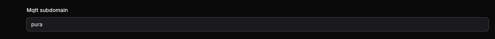

# DNS

### Initial Settings
On the initial installation of the device, the right URL needs to be blocked.
e.g.:
```
b669d1gf8BT.iot-as-mqtt.eu-central-1.aliyuncs.com
```

Maybe the `eu-central-1` needs to be replaced with your initial region.

After the changes and Localkit is started, we need to install the prepared firmware to our devices. This is usually possible via OTA.

### DNS Settings
```
api.eu-pet.com => 10.10.46.105
*.iot-as-mqtt.eu-central-1.aliyuncs.com => 10.10.46.101
```

Every device on Localkit needs to have a subdomain. Enter your desired subdomain and add it to your local DNS.



`pura.iot-as-mqtt.eu-central-1.aliyuncs.com` needs to be rewritten to our IP from localkit-broker