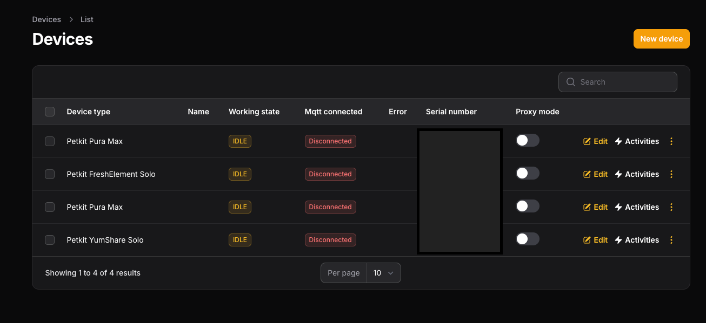

# Installation 

### Docker
We need to Deploy 2 Containers:
- [Localkit](https://github.com/dwyschka/localkit) 
- [Localkit-Broker](https://github.com/dwyschka/localkit-broker)

### Pull Container

```bash
docker pull ghcr.io/dwyschka/localkit:main
docker pull ghcr.io/dwyschka/localkit-broker:main
```

### Docker Compose

```docker-compose.yml
services:
  localkit:
    container_name: localkit
    image: ghcr.io/dwyschka/localkit:main
    cap_add: 
      - NET_BIND_SERVICE
    networks:
      localkit:
      eth0:
        ipv4_address: 10.10.46.105
    volumes:
        - localkit-storage:/var/www/html/storage/app
        - localkit-logs:/var/www/html/storage/logs
        - localkit-database:/var/www/html/storage/database
    environment:
        - APP_TIMEZONE=Europe/Berlin  
        - DB_CONNECTION=sqlite  
        - DB_DATABASE=/var/www/html/storage/database/localkit.sqlite  
        - LOCALKIT_GO2RTC_ENABLE=true  
        - PETKIT_LOCAL_IP=10.10.46.105  
        - LOCALKIT_BROKER_HOST=localkit-broker  
        - LOCALKIT_BROKER_PORT=443  
        - HOMEASSISTANT_PORT=1883  
        - HOMEASSISTANT_HOST=10.10.50.10  
        - HOMEASSISTANT_CLIENT_ID=localkit  
        - BYPASS_AUTH=true
        - BYPASS_AUTH_ID=1
    restart: always
    
  localkit-broker:
    image: ghcr.io/dwyschka/localkit-broker:main
    container_name: localkit-broker
    networks:
      localkit:
      eth0:
        ipv4_address: 10.10.46.101
    restart: always
    environment:
      - LOCALKIT=http://localkit

volumes:
  localkit-storage:
  localkit-database:
  localkit-logs:
       
networks:
  localkit:
  eth0:
    external: true
```

### Create User
We need to create a user for localkit.

#### Docker
```bash
docker exec -it localkit php artisan make:filament-user
```

#### Docker Compose
```bash
docker compose exec localkit php artisan make:filament-user
```

Now visit the WebUI, you should be logged in automatically.


### Devices
If everything is set up correctly, the devices should be visible in the WebUI.
