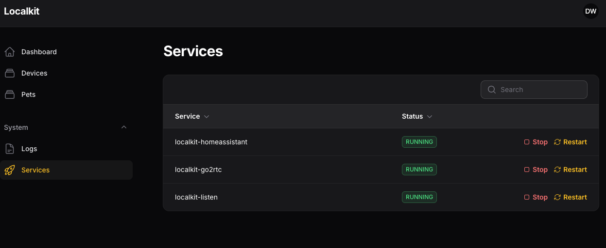
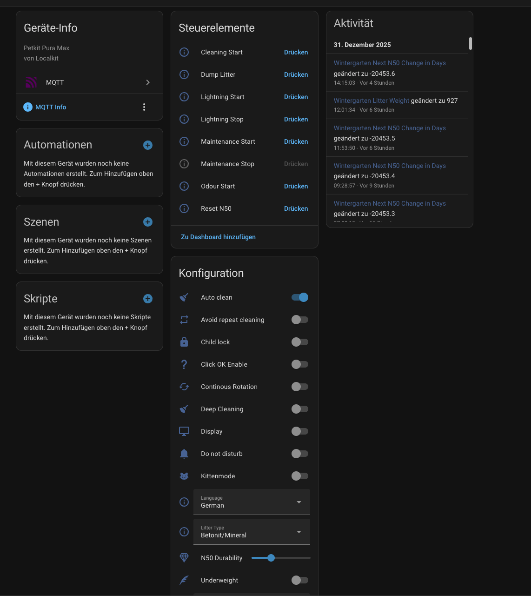

## Home Assistant

It's possible to integrate the Devices in Home Assistant.
The integration is based on MQTT, Autodiscovery is used.

### Configuration
We need to add following Environment-Variables to the Localkit-Container:
```
HOMEASSISTANT_PORT=HOST_PORT  
HOMEASSISTANT_HOST=HOST_IP
HOMEASSISTANT_CLIENT_ID=localkit  
```

Replace IP and Port with your MQTT-Server.

If your MQTT-Broker requires authentication, add following variables too:
````
HOMEASSISTANT_AUTH_USERNAME=USERNAME  
HOMEASSISTANT_AUTH_PASSWORD=PASSWORD
````


## Enable
If your Devices are not connected to Home Assistant, ensure the `localkit-homeassistant` service is enabled and running:



### Screenshot 
