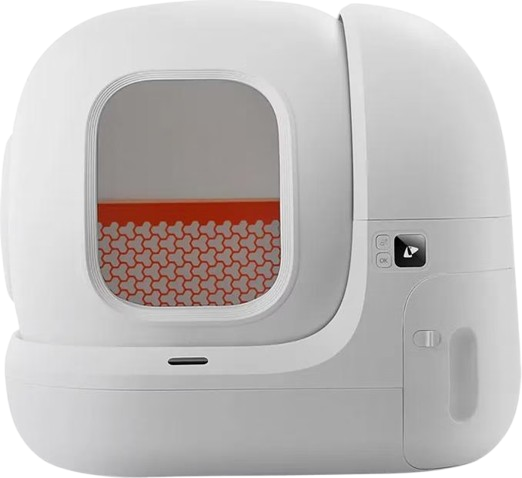
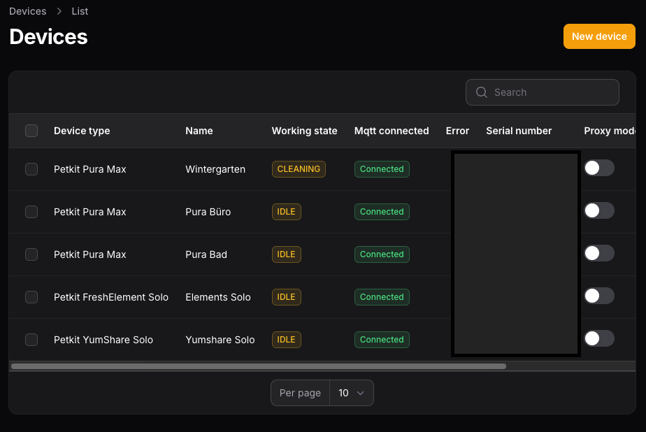

# Pura Max

## Platform
ESP32

## Available Firmware
:::info a modified version of the firmware is used, the downgrade is supported.
:::
1.625 

## Newest Firmware 
1.636

## Features
- Every Feature the Petkit-App has.
- K3-Spray Support
- Bluetooth Proxy is currently *NOT* supported

## Custom Features
Instead of 30-Days, the interval can be changed

## Actions
| Action            | Description                                                             |
|-------------------|-------------------------------------------------------------------------|
| Start Cleaning    | Start manual clean of litter                                            |
| Start Maintenance | Sets Device to Maintenance Mode                                         |
| Stop Maintenance  | Stops Maintenance Mode, only available if device is in maintenance mode |
| Clean Litter      | Please insert litter remover, dumps the litter in the bin               |
| Reset N50 Timer   | Resets the N50 timer to configured days                                 |

## Get Started
:::warning
For the device to be used with Localkit, it must be added in the Petkit app. Devices that have not been added to the network via the Petkit app are currently not supported!
:::

If everthing is set uo correctly, please reboot the device, you should hear a beep.
The device should be visible in the Localkit UI:

- Enable "Proxy Mode" and Enter the Edit View with a click on "Edit".
- Check the "OTA State" Checkbox and press "Save", please enter a "MQTT Subdomain" too.
- The device should now be start to update the firmware. 
- Afterwards the Device should show "Connected" to the MQTT, and is controllable via UI. 

Your Finish :) 

